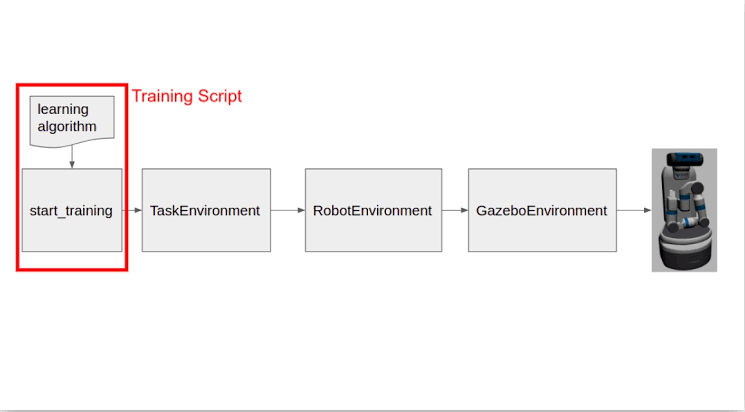
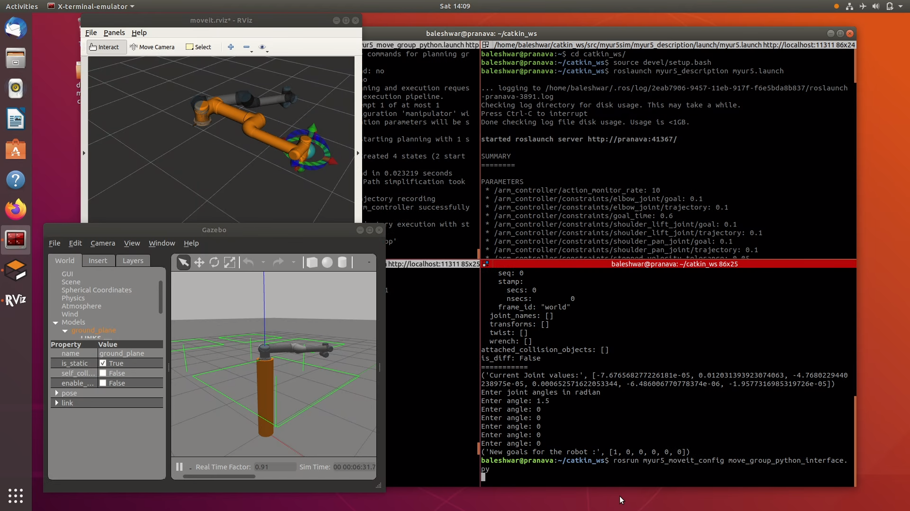
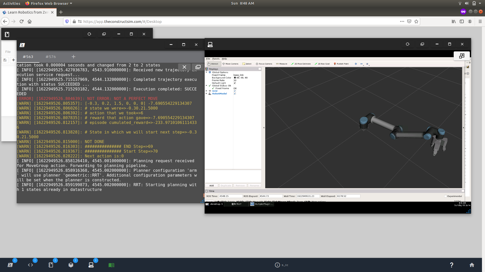
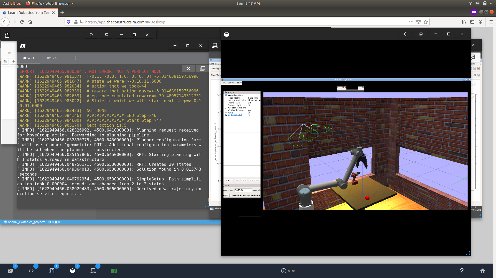

# Trajectory Planning of Robotic Arm Using Reinforcement Learning

[Youtube Video link for Project demo](https://youtu.be/BweuW_VBabs)
## About
This project was done as a remote project intern at the Department of Electrical Engineering , Indian Institute of Technology (IIT ) Roorkee under the guidance of [Dr Sohom Chakrabarty](https://www.iitr.ac.in/~EE/Sohom_Chakrabarty) , Assistant Professor at the Department of Electrical Engineering , IIT Roorkee , Roorkee , Uttarakhand , India . I worked along with Mr Ashish Kumar Shakya , PhD Scholar working on reinforcement Learning based control at the same department  .  
## The working of openai_ros used in the project
   

## The basic control of UR5 using Move Group Python Interface
  

## The directory structure of the project
  

## Training of the Reinforcement Learning agent in the online Construct platform
  

