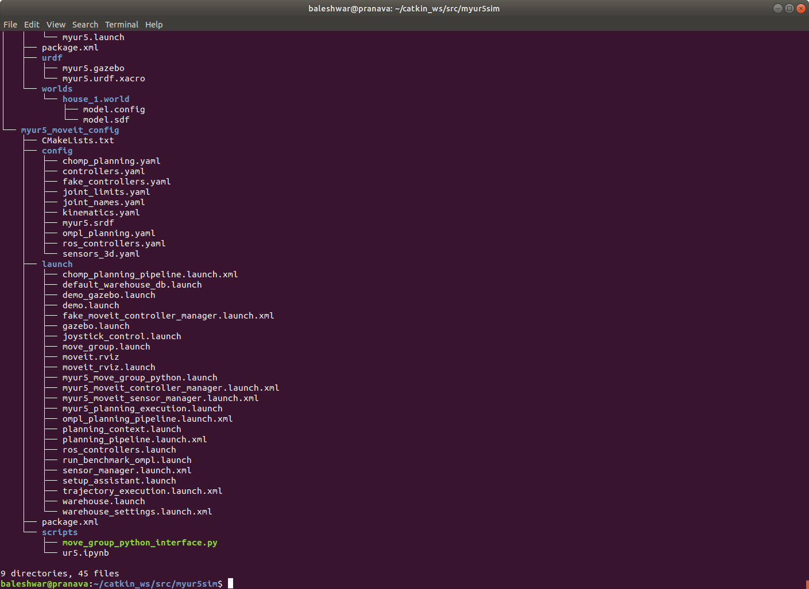

# Trajectory Planning of Robotic Arm Using Reinforcement Learning   

[Youtube Video link for Project demo](https://drive.google.com/file/d/1Fdnk8nNM0aNAOQjNGS5el05eGYqizJdJ/view?usp=sharing)
## About
This project was done as a remote project intern at the Department of Electrical Engineering , Indian Institute of Technology (IIT ) Roorkee under the guidance of [Dr Sohom Chakrabarty](https://www.iitr.ac.in/~EE/Sohom_Chakrabarty) , Assistant Professor at the Department of Electrical Engineering , IIT Roorkee , Roorkee , Uttarakhand , India . I worked along with Mr Ashish Kumar Shakya , PhD Scholar working on reinforcement Learning based control at the same department  .  

## About UR5 Robotic Arm
The Universal Robots UR5, a highly flexible robotic arm that enables safe automation of repetitive, risky tasks. With a carrying capacity of 5 KG and a radius of 850 mm, it is the perfect cobot for performing light tasks such as packing, assembly or testing. 
The UR5 is very easy to set up and program. This gives it one of the fastest payback times on the market. This robot can be operational in less than half a day thanks to the simple way of programming with a 3D visualisation. The robot can be moved manually to the right positions, after which it is stored and can be further adjusted on a touchscreen tablet. More info on UR5 robotic arm can be found [here .](https://www.universal-robots.com/products/ur5-robot/)

## The working of openai_ros used in the project
   
More info on openai_ros package can be found [here.](http://wiki.ros.org/openai_ros)

## The basic control of UR5 using Move Group Python Interface of MoveIt
  
One of the simplest MoveIt user interfaces is through the Python-based Move Group Interface. These wrappers provide functionality for most operations that the average user will likely need, specifically setting joint or pose goals, creating motion plans, moving the robot, adding objects into the environment and attaching/detaching objects from the robot.More info on Move Group Python Interface of MoveIt can be found [here](http://docs.ros.org/en/kinetic/api/moveit_tutorials/html/doc/move_group_python_interface/move_group_python_interface_tutorial.html)
## The directory structure of the project
  

## Training of the Reinforcement Learning agent in the online Construct platform  
The link to the online Construct platform used to train the RL agent can be found [here .](https://www.theconstructsim.com/) . 
  

   
   

